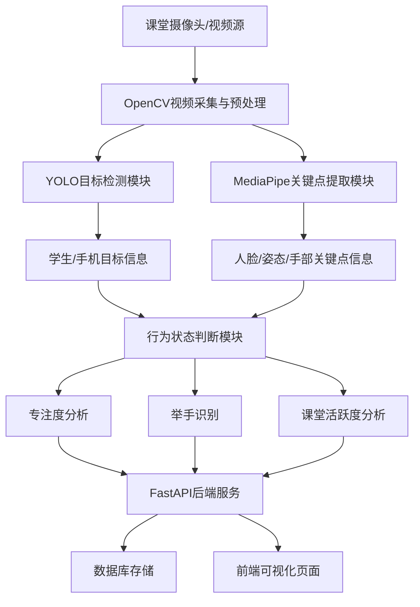
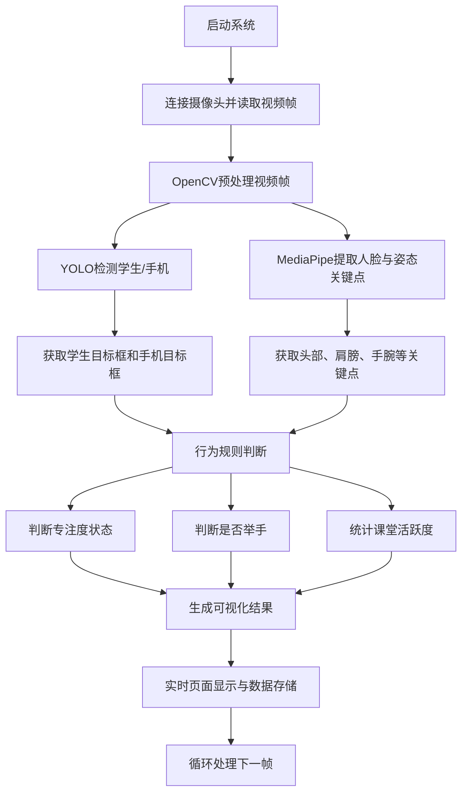

# AI课堂互动与摸鱼检测系统技术方案

## 1. 项目概述

### 1.1 项目背景

在传统课堂教学过程中，教师通常难以及时、全面地掌握学生的课堂状态，例如学生是否专注听讲、是否积极举手互动、课堂整体活跃度是否偏低等。这些信息往往依赖教师主观观察，不仅耗费精力，而且难以形成量化分析结果。随着计算机视觉、深度学习与智能视频分析技术的发展，构建一套面向课堂场景的智能监测系统具有较高的应用价值。

本项目拟设计并实现一套基于摄像头视频流分析的 AI 课堂互动与摸鱼检测系统，对学生课堂行为进行实时检测与统计分析，实现课堂专注度评估、举手行为识别、课堂活跃度分析以及疑似摸鱼行为预警等功能，为教师提供可视化、数据化、智能化的课堂辅助分析工具。

### 1.2 项目目标

本项目的总体目标是构建一套集视频采集、目标检测、姿态分析、行为判断和数据展示于一体的智能课堂分析系统，具体目标如下：

1. 实现课堂摄像头视频流的实时采集与处理。
2. 实现学生个体、手机等目标的检测与定位。
3. 实现学生头部朝向、低头状态、举手状态等行为特征识别。
4. 构建专注度、课堂互动度和课堂活跃度的分析模型。
5. 提供课堂实时监控页面与历史统计分析页面。
6. 形成可用于课堂管理和教学反馈的分析报告。

### 1.3 项目意义

本项目的研究与实现具有以下意义：

1. 提升课堂管理效率，辅助教师快速掌握学生状态。
2. 将课堂互动情况进行量化分析，提高教学反馈的客观性。
3. 推动人工智能与教育场景的融合应用。
4. 为后续智慧教室、教学行为分析系统的扩展奠定基础。

## 2. 需求分析

### 2.1 功能需求

系统应具备以下核心功能：

1. 实时视频采集  
   通过摄像头获取课堂实时视频，并对视频帧进行处理。

2. 学生目标检测  
   检测画面中的学生个体，识别每位学生所在区域。

3. 手机与异常目标检测  
   检测学生周边是否存在手机等可能影响专注度的物体。

4. 人脸与姿态关键点提取  
   获取学生面部、头部、肩膀、手肘、手腕等关键点信息。

5. 专注度分析  
   基于低头、偏头、闭眼、趴桌、手机使用等特征综合评估学生专注度。

6. 举手行为识别  
   判断学生是否处于举手状态，并统计举手人数与持续时间。

7. 课堂活跃度分析  
   结合举手频率、动作变化、互动次数等信息分析课堂活跃水平。

8. 异常行为预警  
   对疑似玩手机、长期低头、疑似瞌睡等行为进行提示。

9. 数据记录与历史查询  
   记录每节课的统计结果，支持历史课堂分析与图表展示。

10. 可视化展示  
    在前端页面实时显示视频、检测框、行为状态、统计图表和预警信息。

### 2.2 非功能需求

1. 实时性  
   系统应尽量满足实时分析要求，单路视频分析延迟控制在可接受范围内。

2. 准确性  
   对学生检测、举手检测、低头识别等功能应具备较高识别准确率。

3. 稳定性  
   系统应能够持续运行，支持长时间视频处理。

4. 可扩展性  
   方便后续增加多摄像头、更多课堂行为类型和报表模块。

5. 可解释性  
   系统输出结果应尽量具备规则来源，便于教师理解与接受。

## 3. 总体技术路线

本项目采用“视频采集 + 目标检测 + 姿态关键点分析 + 行为规则判断 + 数据可视化展示”的技术路线。系统通过摄像头采集课堂视频流，使用 OpenCV 完成帧读取与图像预处理，使用 YOLO 模型对学生与手机等目标进行检测，使用 MediaPipe 提取学生的人脸和姿态关键点，最后结合规则引擎对专注度、举手状态和课堂活跃度进行综合判断，并将结果展示到前端界面。

核心处理链路如下：

`摄像头视频流 -> OpenCV帧处理 -> YOLO目标检测 -> MediaPipe关键点提取 -> 行为状态判断 -> FastAPI数据服务 -> 前端可视化展示`

## 4. 关键技术说明

### 4.1 OpenCV 技术

OpenCV 是系统的视频处理基础库，主要承担以下任务：

1. 摄像头接入与视频流采集  
   使用 OpenCV 打开本地摄像头或网络摄像头，逐帧读取课堂视频。

2. 图像预处理  
   包括图像缩放、格式转换、亮度调节、噪声抑制、帧率控制和区域裁剪。

3. 结果可视化  
   对检测框、关键点、状态标签、专注度分数、举手提示等信息进行叠加显示。

4. 辅助图像分析  
   在活跃度估计中，可以结合帧差法、区域运动变化等轻量方法作为辅助特征。

OpenCV 在系统中起到“输入通道 + 图像处理底座 + 可视化输出层”的作用。

### 4.2 YOLO 目标检测技术

YOLO 是一种适合实时场景的目标检测算法，能够快速识别视频画面中的对象类别和位置。本项目中，YOLO 主要用于检测：

1. 学生个体位置
2. 手机目标位置
3. 可扩展的头部区域或其他课堂相关目标

YOLO 输出的信息包括：

1. 目标类别
2. 目标边界框坐标
3. 目标置信度

系统可先利用预训练模型完成学生与手机的初步检测，再根据课堂实际采集数据对模型进行微调，以提高在教室场景下的检测效果。

### 4.3 PyTorch 深度学习框架

PyTorch 是本项目使用的深度学习运行与训练框架，主要用于：

1. 加载 YOLO 等目标检测模型
2. 使用 GPU 加速模型推理
3. 基于课堂数据对模型进行迁移学习和微调训练
4. 为后续引入行为分类模型提供训练基础

PyTorch 负责模型训练与推理的执行层，是深度学习部分的核心支撑框架。

### 4.4 MediaPipe 人脸与姿态关键点技术

MediaPipe 是一套轻量级实时关键点检测框架，适用于课堂行为分析场景。本项目中可使用以下模块：

1. Face Mesh  
   提取人脸关键点，用于头部朝向、低头状态、闭眼状态和打哈欠特征分析。

2. Pose  
   提取肩膀、手肘、手腕等人体关键点，用于举手、趴桌和身体姿态分析。

3. Hands  
   在需要更细粒度手势分析时，可进一步提取手部关键点。

MediaPipe 的优势在于轻量、速度快、部署方便，适合课程项目中的实时课堂行为检测。

### 4.5 行为状态判断技术

行为状态判断是系统的核心业务逻辑层。其本质是将底层检测结果转化为高层课堂语义结果，例如“专注”“低头”“举手”“疑似玩手机”“课堂活跃”等。

本项目建议采用“规则判断 + 时间序列平滑”的方式实现，主要原因如下：

1. 开发周期短，适合实训项目落地。
2. 结果可解释性强，便于答辩和系统展示。
3. 对数据标注需求较低，实施成本可控。

行为判断示例如下：

1. 低头判断  
   当头部俯仰角持续高于阈值且时间超过设定阈值时，判定为低头。

2. 偏头判断  
   当头部偏航角长时间偏离正前方时，判定为注意力分散。

3. 举手判断  
   当手腕关键点高度高于肩膀或头部关键点，并连续多帧满足条件时，判定为举手。

4. 手机使用判断  
   当学生框附近检测到手机，且头部朝向持续指向手机区域时，判定为疑似玩手机。

5. 课堂活跃度判断  
   综合单位时间内举手人数、举手频次、动作变化程度等指标进行量化评分。

## 5. 系统总体架构设计

### 5.1 系统架构图

### 5.2 架构分层说明

系统可划分为以下五层：

1. 数据采集层  
   负责摄像头接入、视频流获取和原始数据输入。

2. 感知识别层  
   负责学生、手机等目标检测以及人脸、姿态关键点提取。

3. 行为分析层  
   负责专注度、举手状态、活跃度和异常行为的综合判断。

4. 服务与存储层  
   负责实时结果推送、接口服务、数据记录和历史查询。

5. 可视化应用层  
   负责视频展示、状态展示、图表分析和教师查看界面。

## 6. 系统处理流程设计

### 6.1 处理流程图

### 6.2 处理流程说明

1. 系统启动后，连接摄像头获取课堂视频流。
2. 使用 OpenCV 逐帧读取视频并进行基础预处理。
3. 通过 YOLO 检测当前帧中的学生和手机目标。
4. 通过 MediaPipe 提取学生面部和人体姿态关键点。
5. 将检测框和关键点信息输入行为判断模块。
6. 根据设定规则计算学生专注状态、举手状态和全班活跃度。
7. 将结果叠加到画面中，并同步发送给前端展示。
8. 将关键统计数据写入数据库，用于后续历史查询和课堂报告生成。

## 7. 核心模块设计与实现思路

### 7.1 视频采集模块

#### 模块职责

1. 接入摄像头
2. 获取实时视频流
3. 控制帧率和分辨率
4. 向后续模块持续提供视频帧

#### 实现思路

1. 使用 OpenCV 的 `VideoCapture` 打开本地或网络摄像头。
2. 设置适当分辨率，例如 1280×720，以平衡清晰度和推理速度。
3. 对采集帧进行统一尺寸缩放和颜色空间转换。
4. 可根据硬件性能设置抽帧策略，降低模型负载。

### 7.2 目标检测模块

#### 模块职责

1. 检测学生位置
2. 检测手机位置
3. 输出边界框和类别信息

#### 实现思路

1. 加载基于 PyTorch 的 YOLO 预训练模型。
2. 对输入帧执行推理，提取 `person` 与 `cell phone` 类目标。
3. 对检测结果按置信度进行筛选，过滤低可信目标。
4. 输出每个目标的坐标信息，为后续行为分析提供区域定位。

### 7.3 关键点分析模块

#### 模块职责

1. 提取面部关键点
2. 提取人体姿态关键点
3. 为行为分析提供结构化特征

#### 实现思路

1. 对整帧或学生检测框区域运行 MediaPipe。
2. 获取鼻尖、眼角、肩膀、肘部、手腕等关键点坐标。
3. 通过关键点关系估算头部角度、手臂高度和身体姿态。
4. 将关键点结果缓存到时序数据中，供连续帧分析使用。

### 7.4 专注度分析模块

#### 模块职责

1. 评估单个学生的课堂专注程度
2. 统计全班整体专注度
3. 标记疑似不专注行为

#### 实现思路

可建立基于规则的综合评分机制，例如：

1. 初始专注分为 100 分。
2. 连续低头超过阈值时扣分。
3. 长时间偏头或频繁扭头时扣分。
4. 检测到手机并存在持续注视行为时扣分。
5. 姿态正常、面向前方时维持或缓慢恢复分值。

最终输出单个学生专注分数、状态标签和全班平均专注度。

### 7.5 举手识别模块

#### 模块职责

1. 判断学生是否举手
2. 统计当前举手人数
3. 记录举手持续时间和频次

#### 实现思路

1. 读取左右手腕、肩膀和头部关键点坐标。
2. 若手腕高度持续高于肩膀或头部，则判定为举手候选状态。
3. 通过连续帧计数方式确认举手，避免瞬时误判。
4. 输出每位学生的举手状态及课堂整体举手人数。

### 7.6 活跃度分析模块

#### 模块职责

1. 评估课堂整体互动情况
2. 输出时间维度的活跃度曲线
3. 为课堂质量分析提供数据支撑

#### 实现思路

活跃度可基于多个指标综合计算，例如：

1. 某时间窗口内的举手人数
2. 某时间窗口内的举手频次
3. 画面动作变化程度
4. 参与互动学生比例

对各项指标赋予权重后生成活跃度分数，并按时间更新统计曲线。

### 7.7 数据存储与后端服务模块

#### 模块职责

1. 提供接口服务
2. 存储课堂分析结果
3. 向前端推送实时数据

#### 实现思路

1. 使用 FastAPI 提供 REST API 和 WebSocket 服务。
2. 使用 SQLite 或 MySQL 存储课堂统计数据。
3. 将每帧或每时间片分析结果转化为结构化数据保存。
4. 向前端发送专注度、举手人数、活跃度和预警信息。

### 7.8 前端可视化模块

#### 模块职责

1. 展示实时视频分析结果
2. 展示课堂统计图表
3. 展示历史课堂分析数据

#### 实现思路

1. 采用 Vue 或 React 构建前端界面。
2. 使用视频组件展示实时监控画面。
3. 使用图表库展示专注度趋势、活跃度趋势和举手统计。
4. 提供实时监控页、历史分析页和课堂报告页。

## 8. 数据设计建议

系统可设计如下核心数据表：

1. `class_session`  
   存储课堂场次信息，如课程名称、教师、开始时间、结束时间等。

2. `student_state_log`  
   存储学生在某时间点的状态，如专注度、低头状态、举手状态等。

3. `class_summary`  
   存储某节课整体统计信息，如平均专注度、举手总次数、活跃度均值等。

4. `warning_log`  
   存储异常行为预警记录，如疑似玩手机、长时间低头、疑似瞌睡等。

## 9. 项目实施步骤

### 9.1 第一阶段：系统基础搭建

1. 搭建后端项目与前端项目基础结构。
2. 完成摄像头连接与实时画面显示。
3. 建立基础 API 与前端页面框架。

### 9.2 第二阶段：目标检测实现

1. 集成 YOLO 模型。
2. 完成学生和手机目标检测。
3. 在画面中显示检测框与类别标签。

### 9.3 第三阶段：关键点与行为分析实现

1. 集成 MediaPipe 模块。
2. 完成人脸和姿态关键点提取。
3. 实现低头、偏头和举手行为规则判断。

### 9.4 第四阶段：课堂统计与可视化实现

1. 实现专注度评分机制。
2. 实现活跃度分析与统计逻辑。
3. 前端展示图表和预警信息。

### 9.5 第五阶段：测试与优化

1. 优化模型推理速度和检测稳定性。
2. 调整行为判断阈值，降低误判率。
3. 完善系统文档和演示材料。

## 10. 项目难点与解决思路

### 10.1 教室多人遮挡问题

难点：学生数量较多时容易出现相互遮挡，影响检测效果。  
解决思路：优先面向小型演示课堂或前排区域，后续可引入目标跟踪和多摄像头补充。

### 10.2 专注度判定主观性较强

难点：低头不一定代表摸鱼，也可能是记笔记。  
解决思路：采用“疑似不专注”描述，结合持续时间、多特征联合判断，提高合理性。

### 10.3 实时性与精度平衡

难点：模型越复杂，实时性越差。  
解决思路：控制输入分辨率、采用轻量模型、使用抽帧策略和 GPU 加速。

### 10.4 误判问题

难点：单帧行为容易误判。  
解决思路：引入连续多帧判断和时间窗口平滑机制。

## 11. 预期成果

本项目预期形成以下成果：

1. 一套可运行的 AI 课堂互动与摸鱼检测系统原型。
2. 一个可展示实时专注度、举手状态和课堂活跃度的前端界面。
3. 一套课堂历史分析与预警记录功能。
4. 一份完整的项目设计说明书、系统架构图和流程图。

## 12. 总结

本项目围绕课堂教学场景，综合利用 OpenCV、YOLO、PyTorch、MediaPipe 和 Web 可视化技术，实现从视频采集到行为分析再到结果展示的完整闭环。项目方案具有较强的工程可实现性、较好的展示效果和明确的扩展空间，适合作为实训、课程设计或毕业设计项目实施。

在实际开发中，建议优先完成“学生检测 + 低头识别 + 举手识别 + 活跃度统计 + 页面展示”的最小可用版本，再逐步扩展异常预警、课堂报告、多摄像头接入等高级功能。
